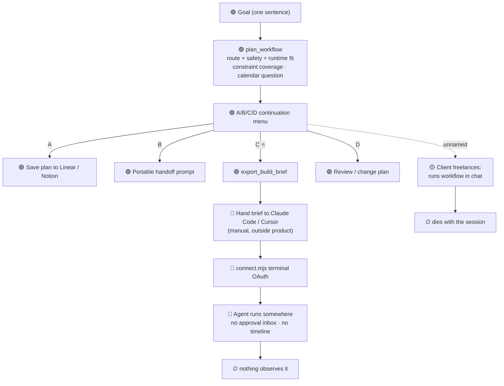
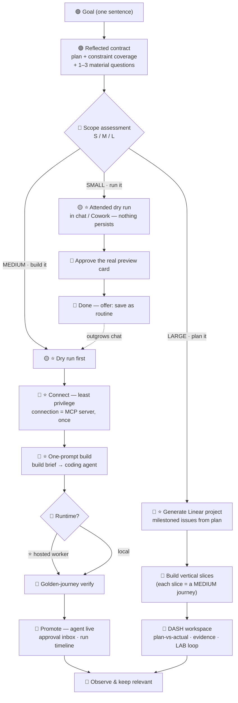
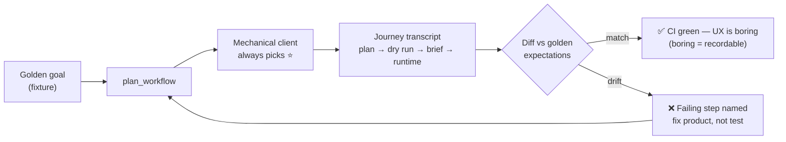

# UX Flowchart — Today vs Target

- **Status:** reference doc, adopted 2026-07-17 (companion to [AGENT_CREATION_UX_SPINE.md](./AGENT_CREATION_UX_SPINE.md))
- **Visual version:** claude.ai artifact "OrchestrateKit — UX Flow: Today vs Target" (Henrik's artifact gallery)
- **Status colors reflect:** master `6ff9bc6` (PRs #116–#119 merged, worker deployed)

**Legend:** 🟢 shipped on master · 🟡 in flight · 🔴 missing · ⭐ recommended path. Following only ⭐ options is the fastest safe path; every branch stays open.

## Today — honest planner, dead-end journey

The plan is now trustworthy (constraint coverage, calendar-notification question, structural no-send). But after the menu every path leaves the product: the user hand-drives a coding agent, OAuth lives in a terminal script, and nothing observes the result.

## Target — one spine, three scope sizes

After the plan, the product **sizes the task** and recommends the matching path. Small tasks never see hosting questions; large ones never get pretended into a single prompt.

### Scope sizing — deterministic drivers

| Size | Drivers (derivable from the plan itself) | Recommended path |
|---|---|---|
| **Small — run it** | attended, no durable trigger, ≤1 low-risk write, ≤2 connections | dry run now → approve → done; offer "save as routine" |
| **Medium — build it** | durable trigger or schedule, 1–3 connections, single runtime, L2–L3 clearance | dry run → connect → one-prompt build → hosted worker → verify → promote |
| **Large — plan it** | multi-agent route, >3 connections, multiple runtimes, ongoing ops | Linear project from plan → build slices as MEDIUM journeys → DASH |

**Design rule:** scope size never gates capability — it only changes which option is recommended first. A small task can still be promoted to a hosted agent; a large one can still be dry-run in chat. The chart is a decision *default*, not a wall.

## The golden-journey test — the self-running check

The MCP is deterministic; the only unpredictable actor is the client LLM. So the test harness replaces it with a **mechanical client that always picks the ⭐ recommended option**. If a mechanical client can complete the journey, an LLM client has no room to freelance — which is exactly what broke the MAR-363 demo takes.

**Recording bar, restated:** MAR-363 gets recorded when the golden-journey test passes 5 consecutive runs with an identical transcript. The test *is* the rehearsal.

## Build order implied by the charts

1. 🟡 Attended dry-run continuation mode (in flight — parallel session)
2. 🔴 Scope assessment in `plan_workflow` (`scope_assessment` field + scope-aware ⭐ in the menu)
3. 🔴 Golden-journey harness (mechanical client + journey fixtures in CI)
4. 🔴 Connect (MAR-383, connection-as-MCP-server) → one-prompt build → promote (MAR-379/377) → observe (MAR-298/384)
